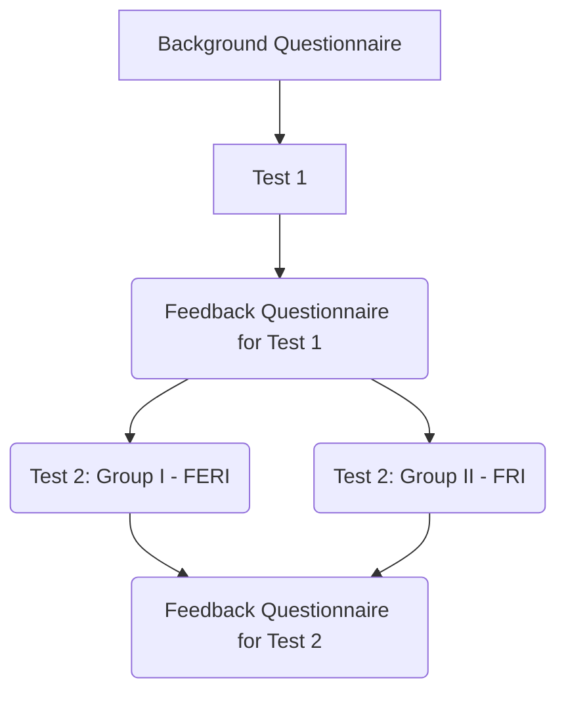

# AG_experiement2022
Supplemental data for the paper
**On Comprehension of Genetic Programming Solutions: A Controlled Experiment on Semantic Inference**
by Boštjan Slivnik, Željko Kovačević, Marjan Mernik and Tomaž Kosar.

The controlled experiment consisted of 
- a [background questionnaire](https://github.com/slivnik/AG_experiement2022/blob/main/AG%20Comprehension%20background%20questionnaire.pdf),
- two tests,
	- [the 1st one](https://github.com/slivnik/AG_experiement2022/blob/main/AG%20Comprehension%20Test1.pdf) given to both groups,
	- the 2nd one in two versions, one [for Group I](https://github.com/slivnik/AG_experiement2022/blob/main/AG%20Comprehension%20Test2%20Group%20I%20(FERI).pdf) and the other [for Group II](https://github.com/slivnik/AG_experiement2022/blob/main/AG%20Comprehension%20Test2%20Group%20II%20(FRI).pdf), and
- two feedback questionnaires,
	- one given [after the 1st test](https://github.com/slivnik/AG_experiement2022/blob/main/AG%20Comprehension%20feedback%20questionnaire%20test1.pdf) and
	- the other given [after the 2nd test](https://github.com/slivnik/AG_experiement2022/blob/main/AG%20Comprehension%20feedback%20questionnaire%20test2.pdf)

as depicted below:

The results
- of the background questionnaire are available in `BackgroundFeedback_AG.xlxs',
- of the tests and feedback questionnaires are available in `StudyResults_AG.xlsx'.

